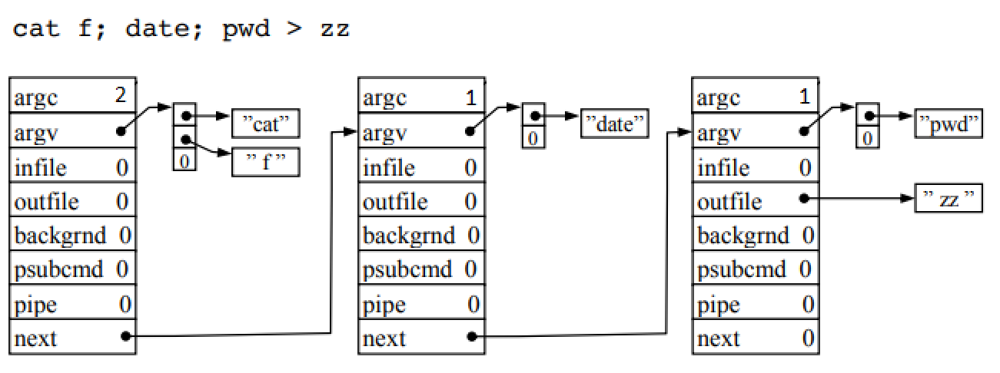
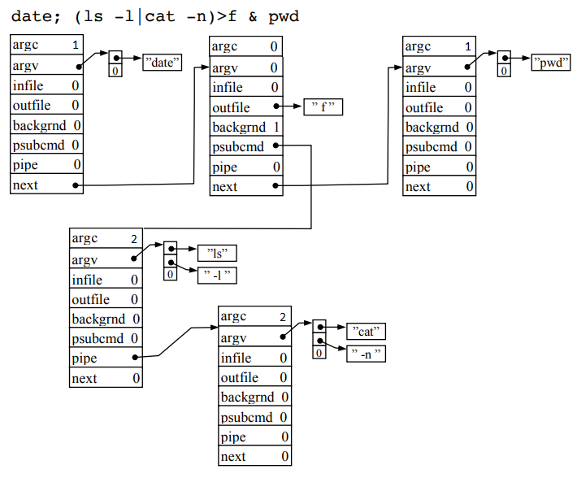

## Shell

## Building
```sh
make
```
## Running
```sh
./shell
```
## Implemented features

### Processing of all sorts of incorrect commands:
```sh
ls;|>>
((pwd)(
...
```
### Built-in commands
```sh
cd   # changes the current directory,
pwd  # prints the full path to the current directory
exit # terminates the interpreter.
```

### Quotes allow to insert a space in an argument or a program name, for example:
```sh
cat "new file" #print a file with name "new file" to the screen.
```
	
		
### Character escaping
Character escaping cancels the special action of the following character, for example
```sh
\"
```
is treated as a regular quote, and not as a delimiter for a quoted string, two backslashes
```sh
\\ 
```
allow to enter a regular single backslash.

### Comments
If the input string contains a `#` symbol (not inside quotes) then the rest of the line is ignored.
```sh
ls #print files in current directory
```
### Substitution of system variables:
```sh
$HOME  # user's home directory
$SHELL # path to the current shell
$USER  # username of the current user
$EUID  # user ID with the rights of which the process is running
```
### Pipes
```sh
program1 | program2 | ... | programN
```
### Redirecting input-output

	<, >, >>
	
### Running in background

	&

### Sequential execution of commands
as if they were passed to the interpreter one by one in a line
```sh
program1 ; program2 ; ... ; programN
```
### Logical operators
Run program1, if successful run program2
```sh
program1 && program2
```
Run program1, if failed run program2
```sh
program1 || program2
```
### Execution of commands in parentheses in a child process:

	(ls | wc) | cat
	(mv f1.c f2.c; cp f2.c f3.c) &
	((((ls) | cat –n ) | cat –n) | sort –r)

## Implementation

The interpreter is written in the C programming language, using the POSIX standard.

Each command to be executed in a separate process is described by the following structure:
```C
struct Tree {
    int argc;             // number of arguments
    char **argv;          // list of command name and arguments
    char *infile;         // redirected standard input file
    char *outfile;        // redirected standard output file
    int backgrnd;         // 1 if the command is to be executed in the background
    next_type type;       // NXT, AND, OR, if ; or && or || are used respectively
    int append;           // 1 if ">>" is used to append to file
    struct Tree *psubcmd; // commands to be run in child shell
    struct Tree *pipe;    // next command after "|"
    struct Tree *next;    // next command after ";", "&&", "||" (or after "&")
};
```
### Examples
```sh
cat f; date; pwd > zz
```

```sh
date; (ls -l|cat -n)>f & pwd
```
